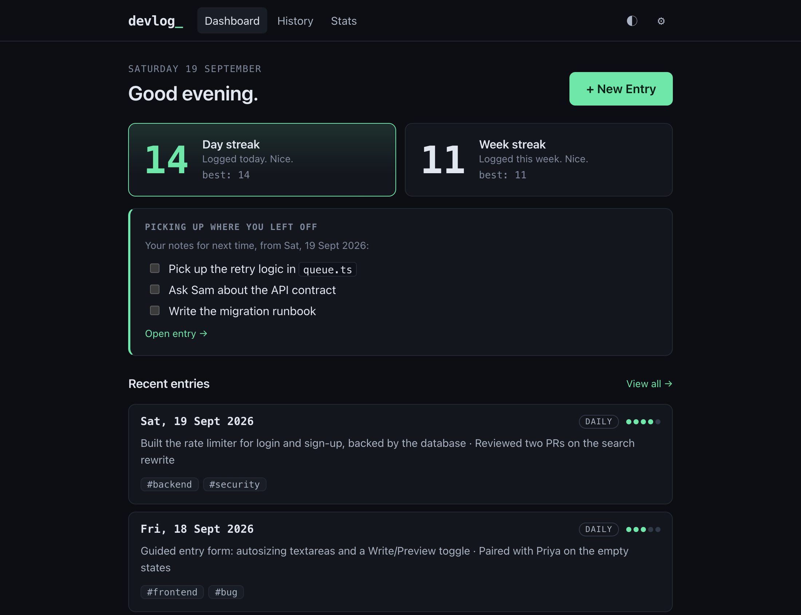
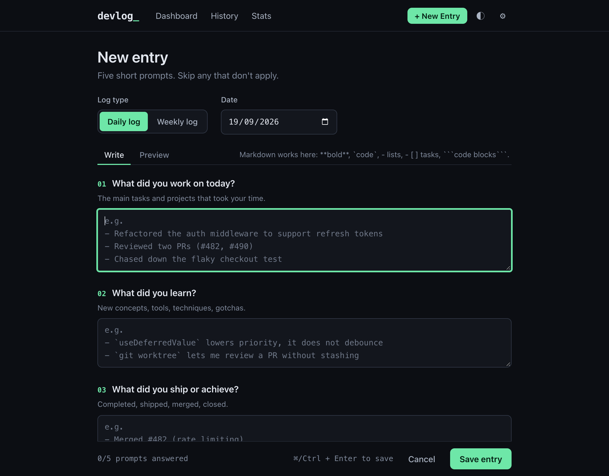
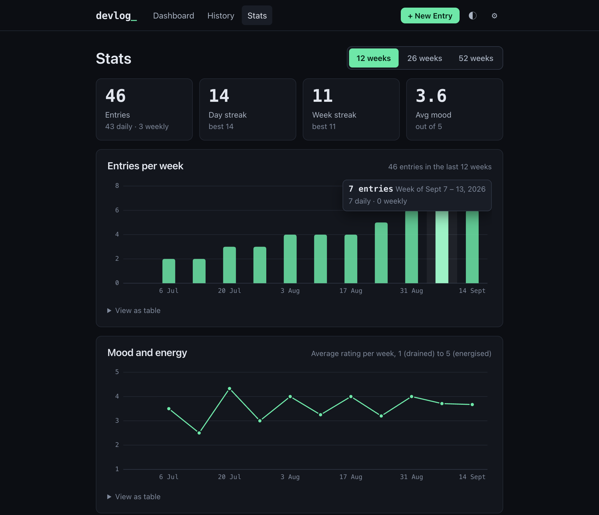
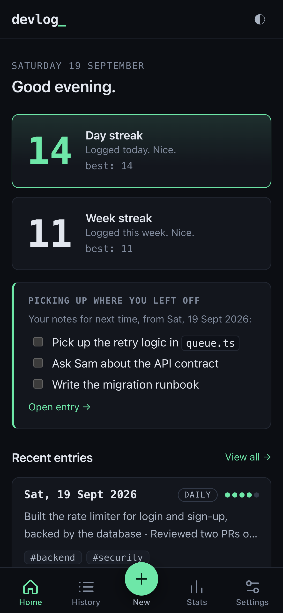

# DevLog

A personal work journal for developers. Instead of a blank page, every entry is a short guided form, so there's never a "what do I even write?" moment.

**Live demo: https://devlog-ng.vercel.app** &mdash; create an account with any email and password. The demo is a real, shared instance: entries are stored in its database and its owner can technically read them, so don't write anything sensitive there.

Built with Node and Express, a libSQL database (a local SQLite file in development, Turso in production), and a dependency-light vanilla-JS frontend with no build step. It's deployed on Vercel's free plan. Under *Design / security notes* and *Deploy for free* below you'll find how authentication, rate limiting and the hosting setup work.

## Screenshots

<p align="center">
  
  
</p>
<p align="center">
  
  
</p>

<sub>Dashboard, guided entry form, stats, and the phone layout. The screenshots use sample data.</sub>

## Run it

```bash
npm install
npm start          # http://localhost:3000
```

Create an account on the sign-in screen and start writing. Requires Node 22. Locally your entries live in a SQLite file at `data/devlog.db` (created on first run).

| Env var               | Default            | Purpose                                                                                     |
| --------------------- | ------------------ | ------------------------------------------------------------------------------------------- |
| `DATABASE_URL`        | `file:` + `data/devlog.db` | A local SQLite file (`file:/path/to/devlog.db`) or a hosted Turso database (`libsql://…`) |
| `DATABASE_AUTH_TOKEN` | unset              | Token for a hosted Turso database (not needed for a local file)                             |
| `ALLOW_SIGNUP`        | `true`             | Set to `false` to stop new accounts being created                                           |
| `PORT`                | `3000`             | Port for `npm start`                                                                        |
| `HOST`                | `127.0.0.1`        | Bind address for `npm start`. Localhost-only by default because this is personal data       |
| `TRUST_PROXY`         | unset (`1` on Vercel) | Number of proxies in front of the app, so cookies get `Secure` and rate limits see the real client IP |
| `APP_URL`             | unset              | The site's public address (e.g. `https://your-app.vercel.app`). Links in emails are built from this, never from the request |
| `BREVO_API_KEY`       | unset              | Turns on password-reset emails through [Brevo](https://www.brevo.com/) (see below)          |
| `EMAIL_FROM`          | unset              | The verified sender address the emails come from (needed with `BREVO_API_KEY`)              |
| `EMAIL_FROM_NAME`     | `DevLog`           | Display name on those emails                                                                |

`npm run dev` restarts on file changes; `npm test` runs the test suite.

## How it works

**Guided entries.** Five labelled prompts (worked on, learned, shipped, blockers, next), each with a coaching hint and an example placeholder, plus optional tags and a 1–5 mood/energy rating. Any single prompt is enough to save. Fields are Markdown (bold, `code`, lists, `- [ ]` tasks, fenced blocks) with a Write/Preview toggle. Unsaved new entries are kept as a local draft.

**Daily or weekly.** Choose per entry; set your default in Settings. Same structure, different framing. A weekly log is stored against its Monday (weeks run Mon–Sun).

**Streaks.** Day streak = consecutive days with a *daily* log. Week streak = consecutive weeks with *any* log. A streak isn't broken until you skip a whole period, so an unlogged "today" doesn't reset it yet.

**History.** Newest first, grouped by month. Search keywords (all prompts and tags), filter by one or more tags (all must match), date range, and log type. Filters live in the URL, so a filtered view can be bookmarked. A weekly log matches any date range that overlaps its week.

**Landing page.** Signed-out visitors see a short product page at `/` (what DevLog is, the five prompts, screenshots, and sign-up / sign-in buttons). Signed-in users go straight to their dashboard. If sign-ups are closed (`ALLOW_SIGNUP=false`) the page only offers Sign in.

**Stats.** Entries per week, average mood per week, most-used tags, over 12/26/52 weeks. Charts are keyboard-navigable and every chart has a "view as table" fallback.

## Design / security notes

- Passwords are hashed with scrypt. Sessions are random tokens in an `HttpOnly`, `SameSite=Lax` cookie; only a hash of the token is stored. Login and sign-up are rate limited, and login timing doesn't reveal whether an email exists. Password reset is covered in its own section below.
- All queries are scoped to the signed-in user and parameterised.
- Markdown is sanitised with DOMPurify, and a strict CSP (`default-src 'self'`) is sent with every response. There are no external fonts, scripts or requests.
- The client sends its own local date for "today", so streaks follow *your* timezone, not the server's.

## Deploy for free: Vercel + Turso

Free hosts wipe the disk on restart, so a SQLite *file* can't live there. Instead the app runs on **Vercel** and keeps its data in **Turso**, a hosted database that speaks SQLite. As of writing, both have free plans that need no credit card (Vercel's Hobby plan is for personal, non-commercial use, which suits a portfolio project).

**1. Create the database** (needs the [Turso CLI](https://docs.turso.tech/cli/installation)):

```bash
brew install tursodatabase/tap/turso
turso auth signup
turso db create devlog            # leave off --tursodb: this app uses the libSQL engine
turso db show devlog --url        # copy this: it is your DATABASE_URL
turso db tokens create devlog     # copy this: it is your DATABASE_AUTH_TOKEN
```

**2. Deploy the app:** in Vercel choose **Add New → Project**, import this GitHub repo, and before deploying add two environment variables, `DATABASE_URL` and `DATABASE_AUTH_TOKEN`, with the values above. Deploy. The tables are created automatically on the first request, so there's nothing to migrate.

**3. Open the `vercel.app` URL**, create your account, and share the link. Pushes to your default branch redeploy automatically.

Good to know:

- **Open sign-up** is the default. To stop new accounts (for example once your friends have joined), add `ALLOW_SIGNUP=false` in Vercel's environment variables and redeploy.
- **Privacy:** passwords are hashed, but entries are stored as plain text in your Turso database, so whoever runs the deployment can read them. Tell your users; the sign-up form says so too.
- **Rate limiting** lives in the database (not memory), so it holds across Vercel's short-lived instances. It keys on the client IP Vercel reports, and failed logins are also limited per email.
- **Static files** (the `public/` folder) are served by Vercel's CDN, so `vercel.json` sets the security headers for them.
- After deploying, check in your browser's dev tools that the `devlog_sid` cookie is marked `Secure`.
- You can also run it on any Node host with a persistent disk: `npm start` with `DATABASE_URL=file:/path/on/the/disk/devlog.db`.

## Password reset

Forgot your password? **Sign in → Forgot password?** emails a link. Signed-in users can also change their password under **Settings**.

- Each link is a 256-bit random token that works **once** and expires after **30 minutes**. Only a hash of it is stored, and asking again cancels the previous link.
- "Forgot password?" gives the same answer whether or not the address has an account, and requests are rate limited per address and per IP.
- The link is built from `APP_URL` (or `localhost` in development), never from the request's `Host` header, which an attacker controls.
- A reset, or a password change, signs out the account's other sessions.
- The link is only shown when the server can actually send email. With no provider configured, **the "Forgot password?" link is hidden** and password reset isn't available.
- Locally, with no provider set, the email is printed to the server's console instead of sent, which is handy for trying it out.
- One known limit: sign-up answers "an account with that email already exists", so an address can still be checked that way while sign-up is open.

**Turning on email in production (Brevo's free plan needs no card):**

1. Create a [Brevo](https://www.brevo.com/) account, add and verify a **sender** (your own email address works to start), and create an **API key**. Follow Brevo's own docs for the exact screens.
2. In Vercel's Environment Variables add `BREVO_API_KEY` (the key), `EMAIL_FROM` (the verified sender address) and `APP_URL` (your site's address, no trailing slash). Optionally `EMAIL_FROM_NAME`. Redeploy.
3. Try "Forgot password?" with an account you own.

Without a domain of your own, Brevo can't authenticate a free-mail sender such as Gmail, so it substitutes a compliant sender address, and messages are more likely to land in **spam**. If that matters, authenticate a domain you own in Brevo. Emails are sent by a small adapter in `server/mailer.js`, so another provider is a small change.

## Layout

```
index.js  Entry point: the Express app (Vercel runs it; server/index.js listens on it)
server/   API, auth, entries, stats, database access (libSQL client)
public/   Static frontend: vanilla ES modules, no build step (public/img holds the landing page's screenshots)
scripts/  copy-vendor.js copies the browser libraries into public/vendor on install
test/     node:test unit + API tests
```

Not included: data export. If you run this without an email provider there is no self-service password reset, so keep your password safe and back up your database.

## Licence

[MIT](LICENSE)
